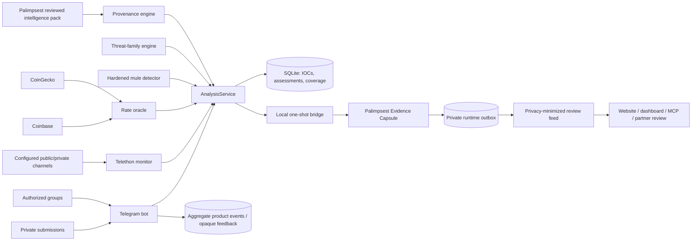

# ScamShield v3: Telegram risk intelligence with Palimpsest provenance

Status: implemented foundation, August 2026.

## Outcome and assumptions

ScamShield v3 broadens the original Telegram money-mule bot into a modular
risk-intelligence system for scams, illicit markets, trafficking-risk signals,
and suspicious money flows. Palimpsest is the evidence and dissemination plane.

The design assumes:

- collection is limited to user submissions, configured public sources, and
  administrator/operator-authorized chats;
- a Telegram message is untrusted evidence, never an instruction;
- message text can support pattern classification but cannot establish guilt,
  ownership, transaction completion, or source of funds;
- public typology reports describe recurring methods, not the provenance of a
  particular payment;
- exact IOCs and matched fragments are private investigation data by default;
- public dissemination requires a privacy-minimized view and human review.

## System map



No source URL inside an intelligence pack or capsule is automatically opened.
No capsule intent can execute code, call a webhook, or publish content.

## One message through the system

1. A collector creates `scamshield-collection/v1` context: authorized surface,
   observation time, script hints, and an optional HMAC source pseudonym.
2. The rate oracle obtains a TTL-cached USDT/INR quote. Two agreeing providers
   produce a median; divergent providers use the higher quote to reduce false
   premium alerts; total failure disables numeric-rate evidence.
3. The hardened detector evaluates rate, account, cash-out, counterfeit-note,
   and illegal-gambling signals with quote and warning/report safeguards.
4. `ThreatEngine` evaluates independent rules for narcotics, wildlife,
   weapons, forgery, stolen access, common fraud, and forced-labour recruitment.
   A subject noun alone is never enough; it needs transaction, fulfilment,
   credential, concealment, or coercion evidence.
5. `ProvenanceEngine` matches both detector and threat signal names against the
   reviewed Palimpsest pack. It keeps mechanism, ecosystem, and predicate
   offence as separate dimensions.
6. ScamShield hashes the raw message, stores structured evidence for suspicious
   events, and records aggregate coverage for clean events. Raw samples remain
   off unless explicitly enabled.
7. WATCH-or-higher assessments cross a bounded local subprocess boundary.
   Palimpsest preserves the exact assessment as inert bytes in an Evidence
   Capsule and verifies its own output. The capsule carries separate typed
   claims for the money-flow detector, broad threat tier/families, and
   provenance hypotheses.
8. Palimpsest's feed generator removes exact IOCs and matched fragments. Its
   default also withholds message-only provenance matches.
9. A private user may explicitly mark a verdict useful, wrong, or uncertain.
   That optional response stores only the assessment ID, original tier, and
   selected response. Telegram identity and message text are not copied into
   the feedback table. A non-text upload that cannot yet be analyzed receives
   an explicit limitation and contributes only an aggregate modality count.

## Shared contracts

### Intelligence pack: `scamshield-intelligence-pack/v1`

Palimpsest is the publisher; ScamShield is the strict consumer. The pack allows
only bounded literal terms and existing signal identifiers. Regexes, code,
templates, shell fragments, and unknown fields are rejected. The raw file's
SHA-256 is recorded in every assessment.

Each typology declares:

- one dimension: `laundering_mechanism`, `operating_ecosystem`, or
  `predicate_offence`;
- a minimum indicator count and specificity;
- authoritative source references;
- explicit limitations;
- literal-term and/or signal-name indicators.

### Assessment: `scamshield-provenance/v1`

The assessment contains:

- message SHA-256, never the raw message by default;
- original detector result and separate threat assessment;
- market-rate status and provider provenance;
- collection surface and privacy-safe context;
- pack version and digest;
- hypotheses, abstentions, and limitations;
- exact IOCs only for suspicious local/private evidence handling.

### Evidence Capsule: `palimpsest-evidence-capsule/v1`

Palimpsest embeds the exact assessment bytes, creates typed claims about fields
the assessment records, and uses recomputable JSON-pointer derivations. Capsule
verification proves byte integrity and reference consistency—not the truth of
the message, detector correctness, or criminal origin.

### Public record: `palimpsest-scamshield-public-record/v1`

The public projection includes tiers, families, IOC counts, source pseudonym,
eligible provenance, and limitations. It excludes IOC values, raw text, matched
phrases, and external-observation narratives. Every record remains
`HUMAN_REVIEW_REQUIRED`; the generator does not publish automatically.

## Threat taxonomy and moderation posture

| Family | Required evidence shape | Maximum text-only posture |
|---|---|---|
| Money mule / laundering | Rate/account/cash-out mechanics with strong-family gates | Confirmed pattern |
| Narcotics market | Drug commodity + sale/payment/delivery/contact/concealment | Confirmed pattern |
| Wildlife market | Protected product + offer and illegality/logistics/contact | Likely; human review |
| Weapons market | Weapon + offer and licensing/fulfilment/payment evidence | Confirmed pattern |
| Forged documents | Explicit forged product + offer/contact/payment | Confirmed pattern |
| Stolen access | Specific access product + offer/payment/contact | Confirmed pattern |
| Task/investment/advance-fee | Scam signature + upfront funds/return/credential action | Confirmed pattern |
| Forced-labour recruitment | Risk geography/job + coercion/control evidence | Likely; safeguarding |

`CONFIRMED_PATTERN` confirms that the message satisfies a tested pattern. It is
not a factual finding about the sender or an instruction to prosecute.

## Source-of-funds reasoning

Provenance uses three non-probabilistic support levels:

1. `TYPOLOGY_MATCH` — submitted message evidence only.
2. `CORROBORATED_LEAD` — at least two independent external source groups across
   at least two evidence classes.
3. `DIRECT_LINK` — authoritative, direct, exact-IOC public-record match whose
   `matched_ioc_kind` and `matched_ioc_value` bind to an IOC extracted from the
   current message. A case record about a different IOC cannot upgrade a lead.

Ten rows from one vendor remain one backer. A general law-enforcement report is
typology background, not case-specific corroboration. Chinese underground
banking may be legitimate or illicit; *feiqian* language cannot by itself prove
drug, cartel, scam, or wildlife proceeds.

## “Whole Telegram” as a coverage program

Universal Telegram access is neither technically available nor an acceptable
default. Broad coverage is instead a measurable program:

- **Configured:** source appears in the explicit watch registry.
- **Resolved:** the dedicated collector can access it.
- **Observed:** messages arrive and coverage timestamps advance.
- **Analyzed:** detector/rate/pack versions are recorded.
- **Shared:** qualifying assessment reaches a verified Palimpsest capsule.
- **Reviewed:** an analyst approves or rejects a dissemination candidate.

Current `/coverage` reports observed messages, flags, errors, surfaces, and
pseudonymized sources. Scaling should add source-registry metadata, collector
heartbeats, lag, language recall sets, and per-family precision/recall—not a
marketing claim of total coverage.

The owner-only `/liquidity` view uses a separate UTC-day coverage ledger and
operator-reviewed monetary observations. Message text is never converted into
a monetary fact automatically. Reviews remain bound to the assessment hash and
HMAC-pseudonymized source; the rendered pulse contains counts and gated sums,
not source pseudonyms or raw message fragments. Existing all-time coverage is
not backfilled into daily windows because doing so would manufacture temporal
precision the original table did not record.

## Reliability and failure modes

- Rate providers run concurrently behind a 15-minute cache. Stale/fallback state
  is visible and fallback numbers are non-evidentiary.
- Palimpsest is optional and fail-open for detection: bridge failure is stored,
  while the Telegram response continues.
- SQLite uses WAL and a five-second busy timeout for the bot/monitor processes.
- Clean messages are not exported and do not create assessment rows; they only
  increment coverage. An explicit feedback click may create a separate opaque
  feedback row, but still does not persist the clean message or Telegram user.
- An empty `channels.txt` registers no Telethon message handler. Candidate
  verification never registers a handler or joins a channel; only the separate
  corroboration-gated promotion job can add a verified public username.
- Bridge input is capped at 1 MiB and capsule output at 32 MiB; subprocesses use
  an argv list, no shell, a timeout, and a minimal environment that excludes
  Telegram tokens, API keys, database URLs, and the pseudonym HMAC key.
- Rate providers must remain on their original HTTPS origin after redirects;
  cross-origin redirects are rejected before response data is read.
- Intelligence-pack clauses are literals escaped by ScamShield, so Palimpsest
  data cannot inject regex behavior.

At larger volume, replace the local call with an authenticated queue carrying
the same versioned assessment contract, keep capsules content-addressed, shard
collectors by authorized source, and retain idempotency keys. Do not introduce a
distributed system until queue lag or SQLite contention is measured.

## Privacy, abuse, and legal boundaries

- Use dedicated collection accounts and only sources the operator is permitted
  to access.
- Do not attempt to bypass Telegram access controls, enumerate private chats, or
  impersonate users.
- Do not publish exact IOCs or allegations from message-only matches.
- Keep the HMAC pseudonym key installation-local and out of repositories.
- Raw IOC excerpts are disabled by default and require an explicit environment
  opt-in.
- Acquisition and unsupported-input metrics are UTC-day aggregates. Verdict
  feedback contains no Telegram user ID and cannot recover the submitted text.
- Human-trafficking-risk findings are safeguarding leads. Do not contact or
  confront suspected recruiters, and do not label potential coerced workers as
  criminals.
- Preserve original evidence separately only when policy, consent, retention,
  and legal authority permit it; the default capsule cannot rerun the detector
  because it intentionally lacks raw text.

## Trade-offs and revisit triggers

- Rules are interpretable and high precision but cannot generalize to every new
  slang term. Add a learned model only after a consented, labeled, versioned
  corpus exists and calibrated per-family evaluation is possible.
- Literal Palimpsest packs are safer than remote regexes but less expressive.
  Revisit only with a signed rule DSL and a separately audited sandbox.
- Private users currently see caveated message-only typology matches; public
  surfaces require corroboration. The owner-controlled seam is
  `scamshield/disclosure_policy.py`.
- Current script hints are not language identification. Add evaluated language
  models only when their privacy, size, and false-positive cost are justified.
- Media OCR, voice transcription, historical backfill, entity resolution,
  blockchain analytics, sanctions, and bank-case connectors are future adapters;
  none should silently upgrade support without the independence rules above.

## Verification

Run before deployment or pack changes:

```bash
cd /path/to/scamshield
python3 -m unittest discover tests -v

cd /path/to/palimpsest-site
python3 -m pytest tests/test_scamshield_adapter.py -q
```

The cross-repository smoke path should additionally create a synthetic
WATCH-or-higher message, verify `BridgeReceipt.status == "STORED"`, confirm the
capsule exists in the configured runtime outbox, and run Palimpsest verification
on it.
