# ScamShield vigorous Telegram monitor

Status: implemented design, August 2026.

## Objective and constraints

Reduce live-analysis lag, shorten restart recovery, and expand verified public
coverage without collecting arbitrary private chats or weakening Telegram rate
limits. The source registry remains limited to public usernames and numeric IDs
for chats the dedicated account is explicitly authorized to access.

The single-host design targets up to 100 managed sources on the current Hetzner
service. It keeps SQLite and the existing analysis contract until measured queue
lag, database contention, or host saturation justifies a distributed queue.

## Data flow

```mermaid
flowchart LR
    T[Telethon NewMessage] --> Q[Bounded live queue]
    Q --> W[Live workers]
    Q -->|full: leave unclaimed| H[Durable history recovery]
    R[Authorized source registry] --> F[Independent 60s refresh]
    F --> T
    H --> C[Concurrent source sweeps]
    W --> L[Per-source ordered lock]
    C --> L
    L --> A[Shared analysis semaphore]
    A --> S[(SQLite receipts, cursors, coverage)]
    S --> D[Private aggregate /monitor view]
    V[Candidate verifier] --> P[Corroboration-gated promotion]
    P --> R
```

## Reliability behavior

- Telegram's update callback only enqueues work. Eight workers drain a bounded
  queue; four analysis slots remain the default CPU governor.
- A full queue does not claim the message. The per-source history cursor later
  retrieves it, making overflow a measurable delay rather than data loss.
- Reconciliation runs across four independent sources concurrently. A separate
  history lock prevents overlapping sweeps of one source, while the processing
  lock is released between messages so live work can interleave.
- Cancellation releases an in-progress receipt immediately. Graceful deploys no
  longer leave work waiting for the normal claim lease to expire.
- Source refresh, history recovery, candidate verification, and systemd
  watchdog publication are separate tasks. Failure or latency in one path does
  not suspend the others.
- The monitor heartbeat stores counts and queue depth only. Source IDs, Telegram
  IDs, message text, and exact IOCs are excluded.

## Coverage expansion

Only WATCH-or-higher messages nominate public usernames. Candidate resolution
checks entity type without joining or reading the candidate. The offline policy
job requires fresh Telegram verification and observations from at least two
distinct configured sources before adding a public channel. It runs every 30
minutes, adds no more than five sources per run, and stops at 100 managed
sources.

## Trade-offs

- A bounded queue can delay alerts during an extreme burst, but avoids an
  out-of-memory restart and preserves recovery through history.
- Per-source ordering limits throughput for one exceptionally busy channel, but
  keeps cursor advancement simple and auditable.
- More frequent public-source evaluation improves discovery speed but increases
  Telegram entity lookups. Existing retry timestamps and FloodWait handling cap
  that pressure.
- Alerting remains limited to `LIKELY_SCAM` and `CONFIRMED_PATTERN`. Increasing
  collection breadth without lowering this threshold avoids turning improved
  coverage into owner-notification spam.

## Revisit triggers

Revisit the single-process architecture when `/monitor` repeatedly shows queue
saturation, recovery sweeps cannot return to zero, resolved sources approach the
managed cap, SQLite busy errors rise, or the Hetzner memory limit is regularly
approached. At that point, retain the same receipt IDs and assessment contract
while moving analysis work to an authenticated queue and sharding collectors by
authorized source.
